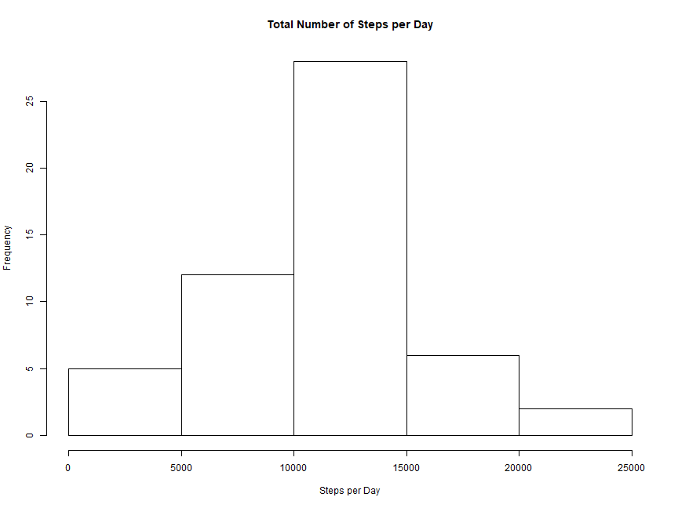
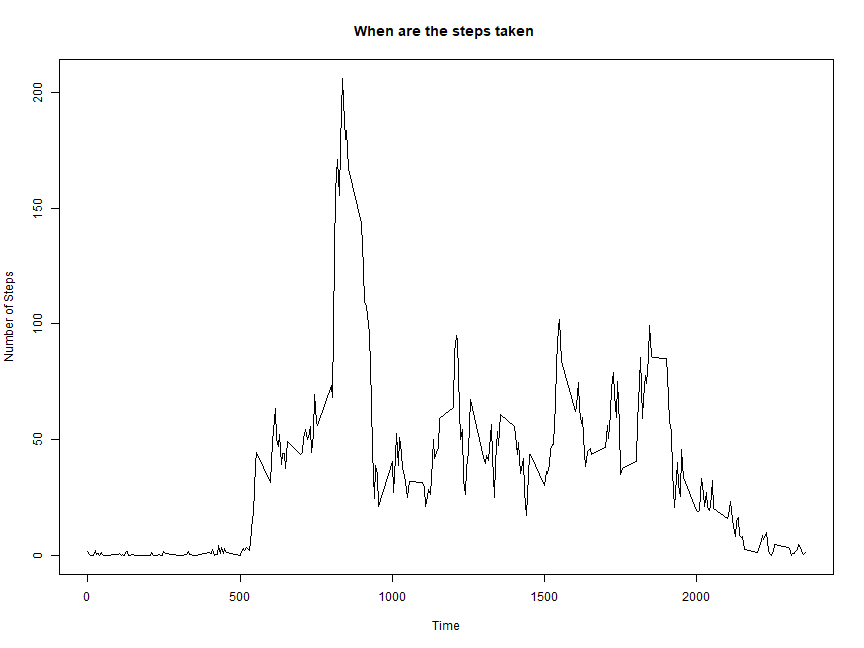
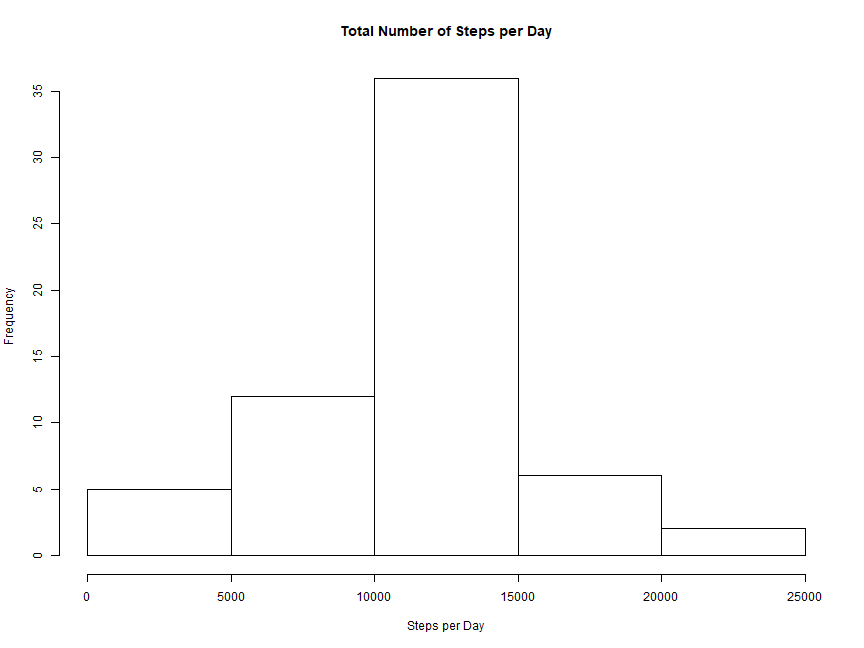
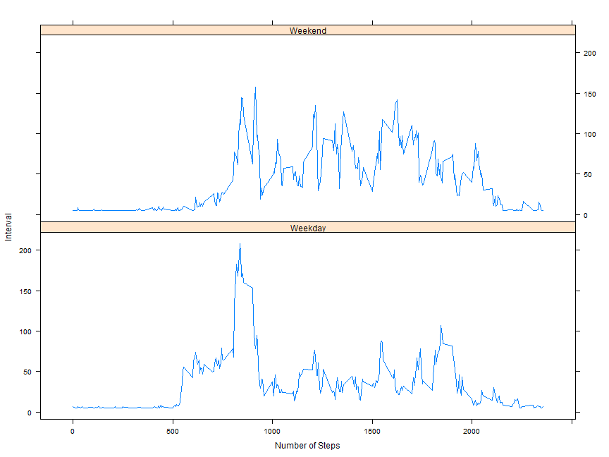

### Loading the data is done through the following code:

```r
data <- read.csv("activity.csv", stringsAsFactors = FALSE)
data$date<-as.Date(data$date)
complete_data <- data[complete.cases(data),]
```

### What is the mean total number of steps:
1. Calculate the total number of steps taken per day and plot via Histogram.

```r
agg_data <- aggregate(complete_data$steps, by=list(complete_data$date), sum, na.rm = TRUE)
colnames(agg_data) <- c("Date", "Steps")
hist(agg_data$Steps, main = "Total Number of Steps per Day", xlab = "Steps per Day")
```


2. Calculate and Report the mean and median of th total number of steps taken per day

```r
steps_mean <- round(mean(agg_data$Steps),2)
steps_median <- round(median(agg_data$Steps),2)

cat(sprintf("Here is the mean: %s\n", steps_mean))
```

```
## Here is the mean: 10766.19
```

```r
cat(sprintf("Here is the median: %s\n", steps_median))
```

```
## Here is the median: 10765
```
### What is the average daily activity pattern
1.  Make a time series plot of Interval and Average Steps taken 

```r
grouped_data <- aggregate(data$steps~data$interval, FUN = mean)
plot(grouped_data$`data$interval`, grouped_data$`data$steps`, type = "l", xlab = "Time", 
      ylab = "Number of Steps", main = "When are the steps taken ")
```



2.  Which Five Minute Interval contains the maximum number of steps?

```r
grouped_data[which.max(grouped_data$`data$steps`),1]
```

```
## [1] 835
```

### Imputting Missing Values
1.  Calculate and report the total number of missing values in the dataset

```r
sum(is.na(data$steps))
```

```
## [1] 2304
```

2. Devise strategy for filling in missing values.  I will use the mean to replace NA.

3. Create a new dataset with filled in missing data

```r
new_data <- data
new_data$steps[is.na(data$steps)] <- mean(data$steps, na.rm  = TRUE)
```

3.  Make a histogram of total steps per day

```r
sample_new <- aggregate(new_data$steps, by=list(new_data$date), sum, na.rm = TRUE)
colnames(sample_new) <- c("Date", "Steps")
hist(sample_new$Steps, main = "Total Number of Steps per Day", xlab = "Steps per Day")
```



* As seen below under my replacment process, the mean and media have not changed.

```r
steps_mean2 <- round(mean(sample_new$Steps),2)
steps_median2 <- round(median(sample_new$Steps),2)

cat(sprintf("Here is the mean: %s\n", steps_mean2))
```

```
## Here is the mean: 10766.19
```

```r
cat(sprintf("Here is the median: %s\n", steps_median2))
```

```
## Here is the median: 10766.19
```
### Are there differences in activity patterns between weekdays and weekends?
1.  Create a new factor variable in the dataset with two levels - "weekday" and "weekend"

```r
library(dplyr)
try_data <- mutate(new_data, type = factor(weekdays(as.Date(new_data$date))))
weekday <- c("Monday", "Tuesday", "Wednesday", "Thursday", "Friday")
try_data <- mutate(try_data, Day = factor(ifelse(type %in% weekday, "Weekday", "Weekend")))
try_agg <- aggregate(steps~interval+Day, try_data, mean)
```

2.  Make a Panel plot

```r
library(lattice)
xyplot(steps~interval|Day, data = try_agg, layout = c(1,2), type = "l", xlab = "Number of Steps", ylab = "Interval")
```



---
output: md_document
---
